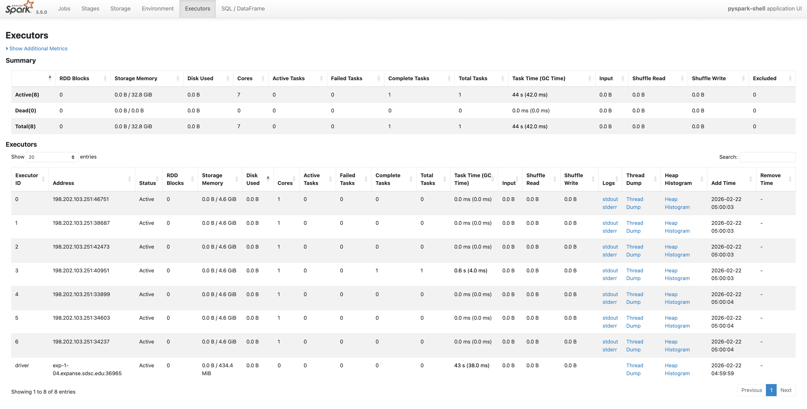
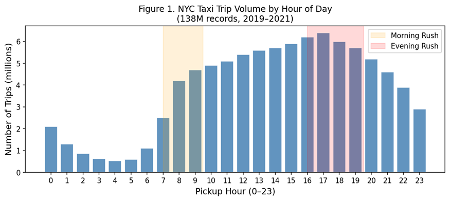
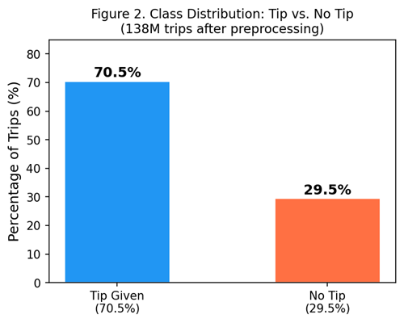
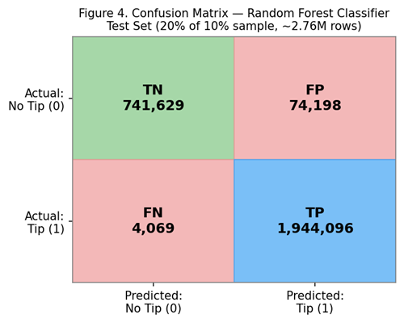
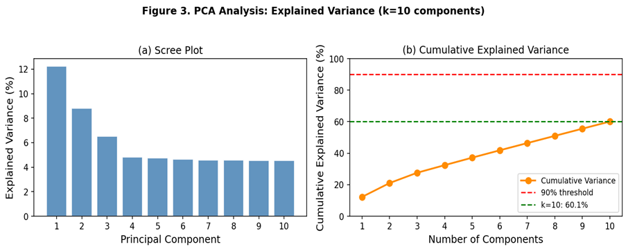
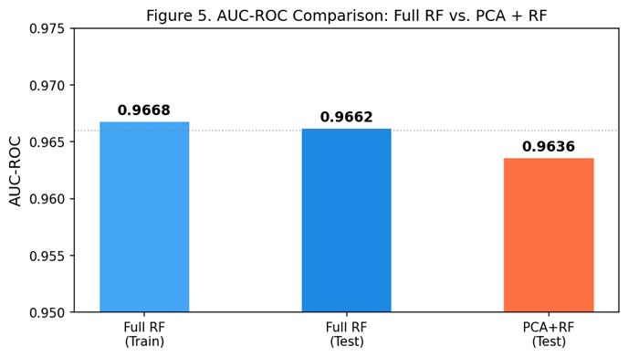

# Predicting Tip-Giving Behavior in NYC Yellow Taxis

> Distributed machine learning with Apache Spark on SDSC Expanse — PCA, Random Forest, and 140 million trip records.

**DSC 232R — Big Data Analytics** &nbsp;|&nbsp; UCSD &nbsp;|&nbsp; Nadine Marcus · John Naughton · Junda Su · Angela Watson
---

## Table of Contents

- [Project Overview](#project-overview)
- [Repository Structure](#repository-structure)
- [Dataset](#dataset)
- [SDSC Expanse Setup](#sdsc-expanse-setup)
- [Methods](#methods)
  - [Data Exploration](#data-exploration)
  - [Preprocessing](#preprocessing)
  - [Model 1 — Random Forest](#model-1--random-forest-classifier)
  - [Model 2 — PCA + Random Forest](#model-2--pca--random-forest)
- [Results](#results)
  - [Model 1 Results](#model-1-results)
  - [Model 2 Results](#model-2-results)
  - [Predictions Analysis](#predictions-analysis)
- [Discussion](#discussion)
- [Conclusion](#conclusion)
- [Statement of Collaboration](#statement-of-collaboration)
- [References](#references)

---

## Project Overview

The NYC Taxi and Limousine Commission (TLC) publishes one of the largest publicly available urban mobility datasets — over 1 billion trip records spanning 2009–2023. This project uses the **2019–2021 subset (140 million trips)** to predict whether a taxi rider will leave a tip, using a fully distributed PySpark pipeline on the SDSC Expanse HPC cluster.

### Why This Problem?

Tipping is a widely-studied but poorly-understood economic behavior. For taxi drivers — who depend on tips as a substantial fraction of their income — a predictive model has genuine economic value. NYC taxi data captures millions of individual journeys encoding time, distance, price, and payment choice across a diverse cross-section of the city's population.

### Why Big Data and Distributed Computing?

| Challenge | Why Single-Machine Fails | Spark Solution |
|---|---|---|
| **Memory** | 140M rows ≈ 15–20 GB RAM — exceeds most workstations | Distributed partitioning across executors |
| **Training time** | Scikit-learn RF is single-threaded; hours on 110M rows | Parallel tree construction across cores |
| **Preprocessing** | Timestamp parsing, encoding on 140M rows slow in pandas | Lazy evaluation, DAG-fused single pass |
| **PCA at scale** | Full distributed pass needed to estimate 18×18 covariance matrix | `pyspark.ml.feature.PCA` distributed solver |

### Broader Impact

- **Drivers:** Route toward high-tip-probability zones and times
- **Platform designers:** Personalize in-app tipping prompts
- **Regulators:** Identify structural compensation inequities for gig workers
- **Urban planners:** Use aggregate tip rates as a proxy for rider willingness-to-pay

---

## Repository Structure

```
.
├── Taxi-Milestone2.ipynb        # EDA, SparkSession setup, initial plots
├── Taxi-Milestone3.ipynb        # Preprocessing pipeline, Model 1 (Random Forest)
├── Taxi-Milestone4.ipynb        # Model 2 (PCA + RF), evaluation, fitting analysis
├── README.md
└── assets/                      
    ├── fig1_trips_by_hour.png   # Figure 1 — trips by pickup hour
    ├── fig2_class_dist.png      # Figure 2 — class distribution
    ├── fig3_pca_variance.png    # Figure 3 — PCA scree + cumulative variance
    ├── fig4_confusion_matrix.png# Figure 4 — confusion matrix
    ├── fig5_model_comparison.png# Figure 5 — AUC comparison
    └── data_loading.png         # Spark UI screenshot 
```

---

## Dataset

- **Source:** [NYC TLC Trip Record Data](https://www.nyc.gov/site/tlc/about/tlc-trip-record-data.page)
- **Subset used:** 2019–2021 Yellow Taxi trips
- **Raw records:** 140,151,844
- **Cleaned records:** 138,214,571 (1.38% removed)
- **Format:** Parquet, stored on SDSC Expanse Lustre filesystem
- **Path on Expanse:** `/expanse/lustre/projects/uci157/awatson4/datasets/taxi`

---

## SDSC Expanse Setup

```
Time Limit:                02:00:00
Num Cores:                 8 (defaultParallelism: 24)
Memory Required Per Node:  64 GB
GPUs:                      0
```

**SparkSession config used:**

```python
spark = SparkSession.builder \
    .appName("Taxi Model") \
    .config("spark.driver.memory", "12g") \
    .config("spark.executor.memory", "12g") \
    .getOrCreate()
```



---

## Methods

### Data Exploration

The raw schema included 19 columns; 14 features were retained for analysis.

| Feature | Type | Key Statistics |
|---|---|---|
| `trip_distance` | Double | Mean: 4.0 mi, Std: 355 (extreme outliers present) |
| `fare_amount` | Double | Mean: $13.2, Max: $998,310 (data quality issue) |
| `passenger_count` | Double | 1.0 = 70.1%; 2.7M nulls → imputed with median |
| `pickup_hour` | Integer | Derived from timestamp; range 0–23 |
| `payment_type` | Long | 6 distinct values (1=Credit, 2=Cash, …) |
| `tip_amount` | Double | 0.0 for 29.5% of trips; positive otherwise |


*Figure 1. Trip volume by pickup hour. Morning and evening rush peaks are visible. Data spans 138M cleaned records.*


*Figure 2. Binary class distribution of the tip label. The dataset is moderately imbalanced (70.5% tipped).*

---

### Preprocessing

All steps implemented as distributed Spark DataFrame operations using PySpark 3.5.0.

**Step 1 — Filter invalid records**

```python
df_clean = df.filter(
    col("tpep_pickup_datetime").isNotNull() &
    col("tpep_dropoff_datetime").isNotNull() &
    (col("fare_amount") > 0) &
    (col("trip_distance") > 0) &
    (col("tpep_dropoff_datetime") > col("tpep_pickup_datetime"))
)
# Result: 140,151,844 → 138,214,571 records (1.38% removed)
```

**Step 2 — Missing value imputation**

-	Non-critical numerical fields will be imputed with summary statistics that are robust to outliers (e.g. `passenger_count` nulls (~2.0%) imputed with median (1.0) via `approxQuantile`)
- Categorical fields (`payment_type`, `RatecodeID`) set to `"missing"` for null values

**Step 3 — Temporal feature engineering**

```python
df_features = df_clean \
    .withColumn("pickup_hour",       hour("tpep_pickup_datetime")) \
    .withColumn("pickup_dayofweek",  dayofweek("tpep_pickup_datetime")) \
    .withColumn("pickup_month",      month("tpep_pickup_datetime")) \
    .withColumn("pickup_year",       year("tpep_pickup_datetime")) \
    .withColumn("trip_duration_minutes",
        expr("timestampdiff(MINUTE, tpep_pickup_datetime, tpep_dropoff_datetime)"))
```

**Step 4 — Target variable creation**

```python
df_features = df_features.withColumn(
    "target_tip_given",
    when(col("tip_amount") > 0, 1.0).otherwise(0.0)
)
# Class weights to handle imbalance:
# weight_tip (1): 0.7093  |  weight_no_tip (0): 1.6945
```

**Step 5 — Encoding and vectorization**

- `StringIndexer` → `OneHotEncoder` applied to `payment_type` and `RatecodeID`
- `VectorAssembler` combines 8 numerical + 2 OHE categorical columns into a single feature vector

---

### Model 1 — Random Forest Classifier

Pipeline: `StringIndexer → OneHotEncoder → VectorAssembler → RandomForestClassifier`

**Parameters:**

| Parameter | Value | Tuning Note |
|---|---|---|
| `numTrees` | 50 | Tuned second; higher values showed diminishing returns |
| `maxDepth` | 10 | Tuned first; primary lever for bias-variance tradeoff |
| `maxBins` | 64 | Increased from default 32 for high-cardinality features |
| `minInstancesPerNode` | 10 | Regularization to prevent overly specific leaves |
| `featureSubsetStrategy` | `"sqrt"` | Standard for classification RF |
| `subsamplingRate` | 0.8 | Row subsampling per tree for variance reduction |

**Training strategy:** A 10% random sample (`df_small`, ~13.8M rows) was used for hyperparameter exploration. An 80/20 random split was applied. A temporal holdout (train < 2021, test on 2021) validated generalization across time.

```python
train, test = df_small.randomSplit([0.8, 0.2], seed=42)
model = pipeline.fit(train)
predictions = model.transform(test)

evaluator = BinaryClassificationEvaluator(
    labelCol="target_tip_given", metricName="areaUnderROC")
auc = evaluator.evaluate(predictions)  # → 0.9662
```

---

### Model 2 — PCA + Random Forest

Adds a dimensionality reduction stage before classification: features are standardised then projected onto the top **k=10 principal components** using `pyspark.ml.feature.PCA`.

**Pipeline stages:**
1. `StringIndexer` (payment_type, RatecodeID)
2. `OneHotEncoder`
3. `VectorAssembler`
4. `StandardScaler` (`withMean=True`, `withStd=True`) — required before PCA
5. `PCA` (k=10, `inputCol="scaled_features"`, `outputCol="pca_features"`)
6. `RandomForestClassifier` (same hyperparameters as Model 1, `featuresCol="pca_features"`)

```python
scaler = StandardScaler(inputCol="features", outputCol="scaled_features",
                        withStd=True, withMean=True)

pca = PCA(k=10, inputCol="scaled_features", outputCol="pca_features")

rf_pca = RandomForestClassifier(labelCol="target_tip_given",
                                featuresCol="pca_features",
                                numTrees=50, maxDepth=10)

pca_pipeline = Pipeline(stages=[
    payment_indexer, ratecode_indexer, encoder,
    assembler, scaler, pca, rf_pca
])
```

---

## Results

### Model 1 Results

| Metric | Train Set | Test Set |
|---|---|---|
| AUC-ROC | 0.9668 | 0.9662 |
| Accuracy | — | 97.17% |
| Precision | — | 96.32% |
| Recall | — | 99.79% |
| F1-Score | — | ~97.97% |


*Figure 4. Confusion matrix — Random Forest, test set (~2.76M rows). TP=1,944,096; TN=741,629; FP=74,198; FN=4,069.*

The model achieves near-perfect recall (99.79%), missing only 4,069 of 1,948,165 true positive cases. The train-test AUC gap of 0.0006 confirms negligible overfitting.

---

### Model 2 Results

**Explained variance by component:**

| Component | Explained Variance | Cumulative |
|---|---|---|
| PC 1 | 12.25% | 12.25% |
| PC 2 | 8.80% | 21.05% |
| PC 3 | 6.53% | 27.58% |
| PC 4 | 4.81% | 32.39% |
| PC 5 | 4.76% | 37.15% |
| PCs 6–10 | ~4.6% each | 60.07% |


*Figure 3. PCA explained variance. (a) Scree plot; (b) Cumulative variance — reaching 90% would require 20+ components.*

**AUC comparison:**

| Model | Train AUC | Test AUC | Gap |
|---|---|---|---|
| Full RF (Model 1) | 0.9668 | 0.9662 | 0.0006 |
| PCA + RF (Model 2) | ~0.964 | 0.9636 | ~0.000 |


*Figure 5. AUC-ROC comparison. The PCA model loses only 0.003 AUC while compressing the feature space by ~44%.*

---

### Predictions Analysis

| Type | Count | % of Total | Key Pattern |
|---|---|---|---|
| ✅ True Positives | 1,944,096 | 70.3% | Card-paid trips; model confidence >0.95 |
| ✅ True Negatives | 741,629 | 26.8% | Short/cheap/cash trips; confidence >0.98 |
| ❌ False Positives | 74,198 | 2.7% | High fare, short distance; ambiguous context |
| ❌ False Negatives | 4,069 | 0.15% | Atypical fare/distance ratio; confidently wrong |

---

## Discussion

### Are These Results Believable?

A 97.17% accuracy warrants careful scrutiny. The most likely source of inflated performance is **data leakage via `payment_type`**: cash-paying riders physically cannot leave an electronic tip, so `tip_amount` is structurally 0.0 for all cash payments. The model may have learned this data-entry pattern rather than genuine tipping behavior. A rigorous follow-up would re-run both models excluding `payment_type`.

Other considerations:
- **Class imbalance:** A naive "always tip" classifier achieves 70.5% accuracy. Our model far exceeds this, suggesting genuine signal beyond payment type.
- **Temporal drift:** The temporal holdout (train <2021, test 2021) yields AUC 0.9569 vs. 0.9667 for random split — a small but real drop indicating mild concept drift.
- **10% sampling:** All training used ~13.8M rows. Results may differ at full 138M-row scale.

### Fitting Analysis

Both models sit in the **well-generalized region** of the bias-variance curve:

- **No overfitting:** Train-test AUC gap is 0.0006 (Model 1) and ~0.000 (Model 2)
- **No underfitting:** AUC consistently above 0.95; 50-tree depth-10 RF is sufficiently expressive
- **PCA model:** Slightly higher bias (Δ AUC = 0.003) from information loss, but still well-generalized. Random Forest already handles correlated features via random subspace sampling, so PCA provides less benefit than it would for a linear model.

### What the PCA Analysis Reveals

- **PC1 (12.3%)** captures the fare/distance/duration axis — expensive vs. cheap trips
- **Flat scree (PCs 2–10 at 4.5–8.8% each)** indicates distributed, moderate structure — no dominant second axis
- **60% variance at k=10** suggests features are not highly collinear — PCA achieves limited compression
- **90% variance requires 20+ components** — near the full feature set, confirming PCA's modest impact on RF performance

### Shortcomings

| Issue | Impact | Suggested Fix |
|---|---|---|
| `payment_type` leakage | May explain most of the high accuracy | Re-run models without this feature |
| 10% sampling | FN=4,069 may become ~40,000 at full scale | Train on full 138M rows |
| PCA k not optimized | 60% variance captured; 90% needs k≈20 | Select k by cumulative variance threshold |
| No feature importance back-projection | Can't interpret which raw features drive PCA model | Project RF importances back to original space |
| COVID-19 in training data | 2020–2021 ridership drop may confound patterns | Separate pre/post-COVID training sets |

---

## Conclusion

**Model 1 (Random Forest):** AUC-ROC 0.9662 · Accuracy 97.17% · Precision 96.32% · Recall 99.79%. Near-zero train-test gap confirms excellent generalization.

**Model 2 (PCA + Random Forest):** AUC-ROC 0.9636 — only 0.003 lower — while compressing ~18 features to 10 principal components retaining 60.1% of variance. Tipping is predictable from a substantially more compact representation at minimal performance cost.

### Future Directions

1. **Remove `payment_type` and re-evaluate** — most critical next step to test for leakage
2. **Gradient Boosted Trees (GBT)** — typically outperforms RF on structured tabular data
3. **Logistic Regression on PCA features** — linear models benefit more from orthogonalized inputs
4. **K-Means on PCA components** — discover trip archetypes (urban hops, airport runs, night rides)
5. **SVD via `RowMatrix.computeSVD`** — compare against PySpark PCA at full scale
6. **Hyperparameter search with CrossValidator** — grid over `numTrees`, `maxDepth`, and PCA `k`

### Reflections on Big Data Processing

Processing 140 million records is qualitatively different from 140,000. The primary challenge is not raw computation but **pipeline design** — lazy evaluation, partitioning strategy, and avoiding unnecessary materializations. Understanding why `.count()` triggers full recomputation required a meaningful shift from the pandas workflow.

The availability of 24 cores on Expanse changed what was tractable. Rather than choosing between "analyze a small sample well" or "analyze the full data poorly," we could train on 110 million rows — shifting the scientific question from "what can we do with a sample?" to "what does the full population tell us?"

With more time, we would extend to the full TLC dataset (2009–2023, ~1.5 billion rows) to study how tipping behavior evolved across the smartphone era, the rise of Uber/Lyft, and COVID-19.

---

## Statement of Collaboration

| Name | Role | Summary |
|---|---|---|
| **Nadine Marcus** | Writer & Analyst | Gave ongoing feedback, present in every team call. Assisted with initial set up of the SparkSession and SDSC Expanse cluster environment. Did the initial data preprocessing and exploratory analysis. Authored the official project write-up and associated website page. Provided ongoing analytical feedback during model development. Sporadic SDSC Expanse troubles.
| **John Naughton** | Contributor | Set up initial repository, updated README, joined calls when available, and provided commentary when requested. Ongoing limitation with SDSC Expanse access.
| **Junda Su** | ML Engineer & Documentation | Active contributor throughout the project and present on every team call. Took the lead on Milestone 2 technical work — assisted in the set up of the SparkSession and SDSC Expanse cluster environment, added EDA plots and annotations, contributed the data loading figure, and wrote the preprocessing plan. Merged the Milestone 2 pull request and coordinated integration of teammates' work. Provided ongoing technical feedback and collaboration across milestones. Initially experienced SDSC Expanse access issues.
| **Angela Watson** | Project Manager & Lead ML Engineer | Coordinated team meetings, managed project deadlines, and maintained communication with teaching staff. Primary contributor across all milestones. Drove the technical implementation from start to finish — authored the initial commit, built the full data preprocessing pipeline, trained the Random Forest classifier (Model 1), and implemented the PCA model with confusion matrix and evaluation analysis for Milestone 4. Laid out the structure and content of the project notebook across every milestone, which served as the foundation for the written report. Maintained the README throughout and resolved merge conflicts. Present and actively contributing on every team call.

---